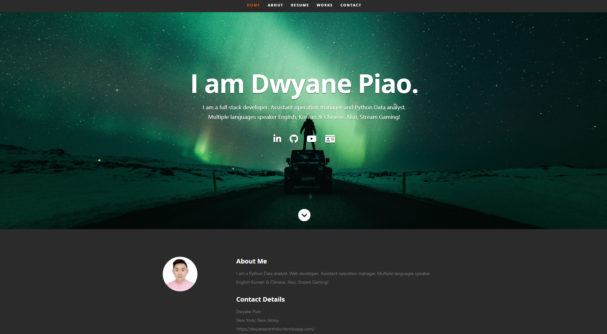

# React Portfolio

Install

This project uses VS Code, GitBash, Mongo DataBase Atlas and NoSQL Please check you have correctly installed those program

Please ensure each of your program account created with SSH key or passwrod.

Please ensure running "npm i" to install all dependencies.

---

Usage （purpose）

This application will allow User able to track their money is important, but allowing them to access that information anytime is even more important. Having offline functionality is paramount to our applications success. It be shown on the page, and added to their transaction history whenever their connection is back online.

Local App start: Please enter "node server" or "npm start" at your terminal. Please ensure installed all dependencies.

---

Contributing

for future reference

---

License

for future reference

---

## Review

You are required to submit BOTH of the following for review:

- The URL of the deployed application.
  https://github.com/sj212131/DwyanePortfolio
- The URL of the GitHub repository that contains your code. Give the repository a unique name and include a README file that describes the project.
  https://github.com/sj212131/DwyanePortfolio

